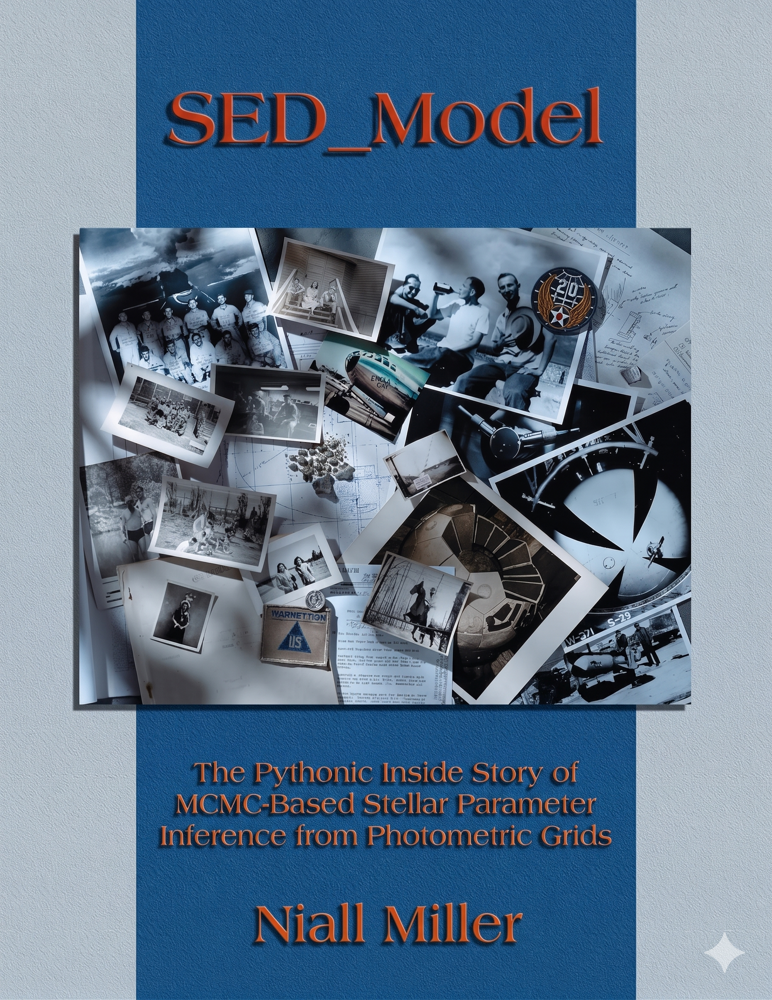

<p align="center">
  
</p>

# SED_Model

**Synthetic photometry and stellar parameter inference.**

SED_Model is a Python package for computing observer-ready synthetic spectral energy distributions (SEDs) and broadband magnitudes from stellar atmosphere grids, and for recovering stellar parameters from observed photometry via Bayesian MCMC inference. It works directly downstream of [SED_Tools](https://github.com/nialljmiller/SED_Tools) and as a standalone drop-in for workflows that use MESA-style atmosphere grids and filter transmission curves.

Current version: **0.1.7** ([PyPI](https://pypi.org/project/sed-model/))

## Two paired models, one parameter language

- **Forward model** — maps `(Teff, logg, [M/H], R, d)` to an interpolated SED, bolometric flux and magnitude, and synthetic magnitudes in any set of loaded filters.
- **Inverse model** — maps observed magnitudes with uncertainties to a posterior distribution over `(Teff, logg, [M/H])`, and optionally over `Av` and distance, via [`emcee`](https://emcee.readthedocs.io/) MCMC sampling.

Both directions operate through a shared [`FitParams`](guide/parameters.md) object. The same parameter specification flows from the forward model to the likelihood evaluator inside the sampler and back out again.

```text
SED_Tools  ->  build/download SED grids and filters
SED_Model  ->  generate synthetic magnitudes and infer stellar parameters
```

## Features

- Hermite and linear interpolation over 3D atmosphere grids `(Teff, logg, [M/H])`.
- Photon-counting filter convolution in Vega, AB, and ST photometric systems.
- Precomputed zero-points matching MESA `colors/private/synthetic.f90` conventions.
- Pure-NumPy interstellar dust extinction with six supported laws, including Gordon et al. (2023).
- Bayesian stellar-parameter inference via `emcee` with fixed, bounded, and fully free parameter modes.
- Structured result containers with summaries, persistence to CSV and NPZ, and interpolation diagnostics.
- Fortran kernels for performance-critical paths, compiled via `f2py`/Meson.
- Forward tests validated against MESA colors reference outputs; inverse tests verified by self-consistent synthetic recovery.

## Where to go next

- [Installation](installation.md) — install from PyPI or source, and build the Fortran extension.
- [Quick Start](quickstart.md) — a forward and an inverse run in a few lines.
- [User Guide](guide/grids-and-filters.md) — grids, filters, both models, parameter modes, extinction, and I/O.
- [Demonstrations](demos/index.md) — full walkthroughs of every script in `demos/`, with the actual source embedded.
- [API Reference](api.md) — generated directly from the docstrings in the source.

## License

SED_Model uses a mixed-license structure. The Python source code, documentation, examples, tests, and packaging files are distributed under the MIT License. The Fortran numerical kernels in `fortran/` are distributed under LGPL-3.0-or-later. See [`LICENSE`](https://github.com/nialljmiller/SED_Model/blob/main/LICENSE) and source file headers for details.
